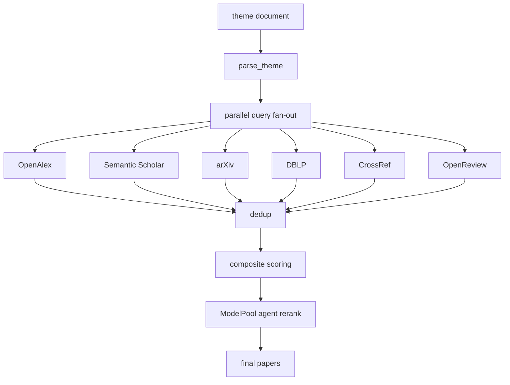
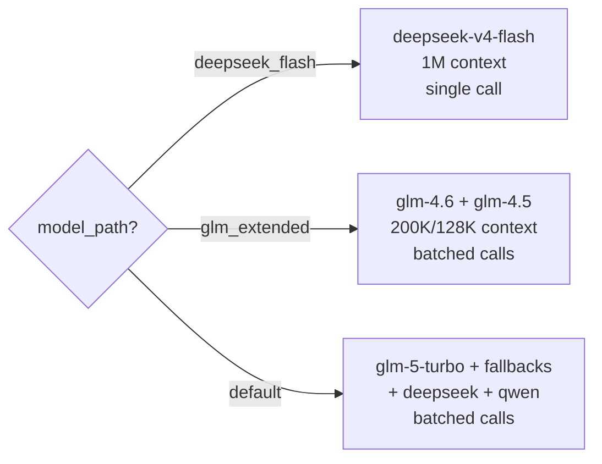

# ScholarTrace

**English** | [中文](README_CN.md)

> Multi-source scholarly paper retrieval and LLM-based reranking, served via MCP for ChatBox and other AI clients.

## What It Does

ScholarTrace takes a theme document, retrieves papers from 6+ scholarly sources, ranks them with a multi-model LLM pool, and exposes two MCP tools for downstream clients.

**Two MCP tools**: `query` (search & rank) and `read` (layered paper access).

**Pipeline**: theme parsing → parallel multi-source retrieval → async dedup/ranking → batched ModelPool LLM rerank → final papers.

**Model pool**: configurable via `SCHOLARTRACE_MODEL_PATH` — `deepseek_flash` (1M context, single call), `glm_extended` (glm-4.6/glm-4.5, 200K/128K), or `default` (glm-5-turbo + fallbacks + deepseek + qwen). Automatic failover and cooldown on all paths.

**Sources**: OpenAlex, Semantic Scholar, arXiv, DBLP, CrossRef, OpenReview, DeepXiv (optional).

## Quick Start

### 1. Configure `.env`

```bash
SCHOLARTRACE_BIGMODEL_API_KEY=<your-bigmodel-key>
SCHOLARTRACE_ACCESS_TOKEN=g203-mcp

# LAN SSE defaults (scripts set these automatically)
SCHOLARTRACE_MCP_TRANSPORT=sse
SCHOLARTRACE_MCP_HOST=0.0.0.0
SCHOLARTRACE_MCP_PORT=8001
SCHOLARTRACE_REMOTE_ACCESS_ENABLED=true

# Optional: DeepXiv
# SCHOLARTRACE_DEEPXIV_TOKENS=token-a,token-b
```

### 2. Start the server

```bash
./run_scholartrace_mcp_sse.sh        # start production (port 8001)
./status_scholartrace_mcp_sse.sh     # check status
./stop_scholartrace_mcp_sse.sh       # stop
./run_scholartrace_mcp_debug.sh      # start debug (port 8002, DEBUG logs)
```

### 3. Connect from ChatBox

Replace `<server-ip>` with your machine's LAN IP:

```json
{
  "mcpServers": {
    "scholartrace": {
      "url": "http://<server-ip>:8001/sse",
      "headers": {
        "Authorization": "Bearer g203-mcp"
      }
    }
  }
}
```

## MCP Tools

### `query` — Search and Rank

```json
{
  "theme_document": "your research topic description",
  "final_limit": 25,
  "agent_candidate_limit": 200,
  "include_rationale": true
}
```

Returns ranked papers with scores, rationales, and full-text status.

### `read` — Layered Paper Access

```json
{
  "paper_id": "theme-id:paper-id",
  "depth": "fulltext",
  "allow_acquire": true
}
```

Depths: `summary` → `sections` → `fulltext` → `direct_evidence`. Each depth returns honest status about what's available.

## Architecture



### Model Path Selection



### Agent Batching

For models with limited context, papers are split into batches via `PromptBudget.pack_items()`, each batch is sent as a separate LLM call, and results are merged by relevance score. The `deepseek_flash` path with 1M context sends all papers in a single call.

Flow diagrams: [`docs/architecture/pipeline_flow.md`](docs/architecture/pipeline_flow.md)

Design docs: [`docs/plans/`](docs/plans/)

## Reliability Features

- **Connector retry**: exponential backoff on 429/5xx/timeout for all 6 sources
- **Per-connector timeout**: each source capped at 45s, won't block others
- **Query retry**: auto-retry when all connectors return empty
- **Overall retrieval timeout**: 300s cap on the entire retrieval stage
- **Model pool failover**: automatic cooldown + next-model fallback on LLM errors
- **Deterministic fallback**: when all LLM models fail, composite scores still return papers

## Configuration

| Variable | Default | Purpose |
|---|---|---|
| `SCHOLARTRACE_MCP_TRANSPORT` | `stdio` | `sse` for LAN serving |
| `SCHOLARTRACE_MCP_HOST` | `127.0.0.1` | `0.0.0.0` for LAN |
| `SCHOLARTRACE_MCP_PORT` | `8001` | SSE port |
| `SCHOLARTRACE_REMOTE_ACCESS_ENABLED` | `false` | Required for LAN SSE |
| `SCHOLARTRACE_ACCESS_TOKEN` | | Bearer token |
| `SCHOLARTRACE_BIGMODEL_API_KEY` | | Primary LLM API key |
| `SCHOLARTRACE_AGENT_CANDIDATE_LIMIT` | `200` | Papers sent to LLM rerank |
| `SCHOLARTRACE_FINAL_LIMIT` | `25` | Final paper count |
| `SCHOLARTRACE_RETRIEVAL_CONNECTOR_TIMEOUT_SECONDS` | `45` | Per-connector timeout |
| `SCHOLARTRACE_RETRIEVAL_TOTAL_TIMEOUT_SECONDS` | `300` | Overall retrieval timeout |
| `SCHOLARTRACE_AGENT_TOTAL_TIMEOUT_SECONDS` | `180` | LLM rerank timeout |
| `SCHOLARTRACE_DEEPXIV_TOKENS` | | Optional DeepXiv tokens |
| `SCHOLARTRACE_MODEL_PATH` | `default` | `deepseek_flash`, `glm_extended`, or `default` |
| `SCHOLARTRACE_DEEPSEEK_FLASH_MODEL` | `deepseek-v4-flash` | Model name for deepseek_flash path |
| `SCHOLARTRACE_DEEPSEEK_FLASH_MAX_CONCURRENT` | `10` | Concurrency for deepseek_flash |
| `SCHOLARTRACE_GLM_EXTENDED_MODELS` | `glm-4.6,glm-4.5` | Comma-separated models for glm_extended |
| `SCHOLARTRACE_GLM_EXTENDED_MAX_CONCURRENT` | `20` | Concurrency for glm_extended |

## Performance Tuning

### Model Paths

Three model paths optimize for different scenarios:

| Path | Context | Best for | Expected time/query |
|------|---------|----------|-------------------|
| `deepseek_flash` | 1M tokens | Large candidate pools, single-call | Fastest |
| `glm_extended` | 200K/128K | Balanced cost/performance | Moderate |
| `default` | 128K | Maximum model diversity | Baseline |

### Debug Server

A debug server on port 8002 runs alongside production for testing:

```bash
./run_scholartrace_mcp_debug.sh     # start debug server
./status_scholartrace_mcp_debug.sh  # check status
./stop_scholartrace_mcp_debug.sh    # stop
```

### Stress Testing

```bash
# Test with deepseek_flash path
SCHOLARTRACE_MODEL_PATH=deepseek_flash python scripts/stress_test_model_paths.py

# Test with glm_extended path
SCHOLARTRACE_MODEL_PATH=glm_extended python scripts/stress_test_model_paths.py

# Custom concurrency
SCHOLARTRACE_STRESS_CONCURRENT=10 python scripts/stress_test_model_paths.py
```

### Timing Logs

All pipeline stages emit `[TIMING]` log lines. Enable DEBUG level on the debug server to see detailed per-connector and per-model-call timing with percentage breakdowns.

## Deployment

### tmux (recommended)

The root-level shell scripts handle `.env` loading, transport defaults, and error checking.

### systemd

See `scripts/scholartrace-mcp.service`. Place secrets in `/etc/scholartrace/scholartrace.env`.

### stdio (debug only)

```bash
SCHOLARTRACE_MCP_TRANSPORT=stdio scholartrace-mcp
```

## Related Projects

- [ScholarAnalysis](https://github.com/BUAAZhangHaonan/ScholarAnalysis) — arXiv paper download, parsing, and focused LLM analysis. Provides MCP tools `get_paper_text` (full Markdown) and `analyze_paper` (focused extraction by question). Use alongside ScholarTrace for complete paper content access.

## License

MIT
