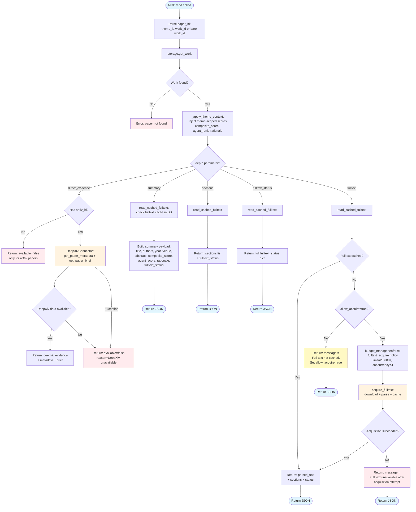
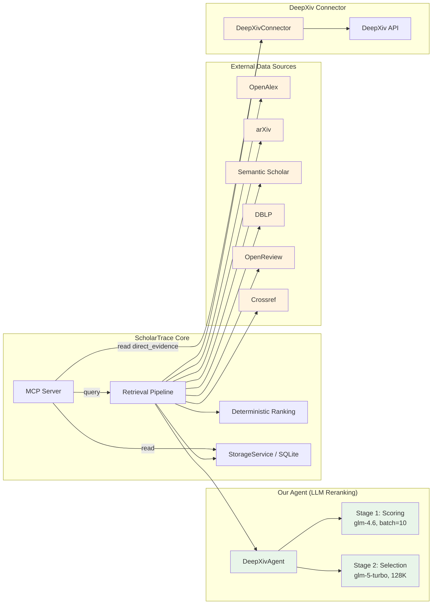

# ScholarTrace Pipeline Flow Diagrams

## Legend

| Symbol | Meaning |
|--------|---------|
| **Blue nodes** | ScholarTrace internal logic |
| **Green nodes** | DeepXivAgent (our LLM reranking) |
| **Orange nodes** | External data sources / connectors |
| **Red nodes** | Fallback / error paths |

---

## 1. Query Pipeline Flow

```mermaid
flowchart TD
    Start([MCP query called]) --> Theme[parse_theme:\nextract queries + compress summary]
    Theme --> Connectors[Build source connectors]

    Connectors --> OpenAlex[OpenAlexConnector]
    Connectors --> Arxiv[ArxivConnector]
    Connectors --> S2[SemanticScholarConnector]
    Connectors --> Dblp[DblpConnector]
    Connectors --> OpenReview[OpenReviewConnector]
    Connectors --> Crossref[CrossrefConnector]
    Connectors --> DeepXivSrc{DeepXiv configured?}

    DeepXivSrc -->|Yes| DeepXivC[DeepXivConnector]
    DeepXivSrc -->|No| SkipDX[Skip]

    OpenAlex & Arxiv & S2 & Dblp & OpenReview & Crossref & DeepXivC --> FanOut[_fan_out_query:\nconcurrent per-query search\nacross all connectors]
    FanOut --> Dedup[deduplicate_candidates]
    Dedup --> Rank[rank_papers:\ndeterministic scoring\nrelevance + recency + influence + venue]
    Rank --> Pool[Coarse pool: top N\nagent_candidate_limit=150]

    Pool --> CheckTwoStage{two_stage_enabled?}

    %% === Two-stage path ===
    CheckTwoStage -->|Yes| Stage1[Stage 1: Distributed Scoring]
    Stage1 --> S1Batches[Split into batch_size=10 batches]
    S1Batches --> S1Concurrent[20 concurrent LLM calls\nglm-4.6 + calibration anchors]
    S1Concurrent --> S1Retry{Batch failed?}
    S1Retry -->|Yes, retries left| S1Concurrent
    S1Retry -->|Yes, max retries| S1Fallback[Deterministic fallback\nrank_papers]
    S1Retry -->|No| S1Score[Compute scores:\nrelevance + recency*0.6\n+ novelty*0.3 + quality*0.2]
    S1Fallback --> S1Score
    S1Score --> S1TopK[Per-batch top-K selection\nK = ceil(final*2 / num_batches)]
    S1TopK --> Stage2[Stage 2: Global Selection]

    Stage2 --> S2Tokens{Estimate tokens\n< 100K?}
    S2Tokens -->|Yes| S2Single[Single LLM call\nglm-5-turbo 128K context]
    S2Tokens -->|No| S2Split[Auto-split into batches\nfit within token limit]
    S2Split --> S2Single
    S2Single --> S2Result{Stage 2 succeeded?}
    S2Result -->|Yes| FinalSelect[Final selected papers\n+ supplement if < final_limit]
    S2Result -->|No| S1Direct[Use Stage 1 scores\ntake top final_limit]
    S1Direct --> FinalSelect

    %% === Single-stage path ===
    CheckTwoStage -->|No| ModelChain[Build model chain:\nglm-5-turbo -> glm-4.7 -> glm-4.6\n-> deepseek -> Qwen3.5-27B]
    ModelChain --> AgentCall[DeepXivAgent.rerank_papers]
    AgentCall --> AgentSuccess{Succeeded?}
    AgentSuccess -->|Yes| AgentResult[Collect reranked results]
    AgentSuccess -->|No| NextModel[Try next model in chain]
    NextModel --> AgentCall
    NextModel -->|All failed| DetFallback[Deterministic fallback\nrank_papers top-K]
    DetFallback --> AgentResult
    AgentResult --> FinalSelect

    %% === Common ending ===
    FinalSelect --> Annotate[Annotate works with\nagent_score, agent_rank, rationale]
    Annotate --> Save[storage.replace_theme_results]
    Save --> Payload[Build JSON payload:\ntheme_id + papers + counts]
    Payload --> Response([Return to MCP client])

    %% Styling
    style Start fill:#e1f5fe
    style Response fill:#e1f5fe
    style Stage1 fill:#e8f5e9
    style Stage2 fill:#e8f5e9
    style AgentCall fill:#e8f5e9
    style S1Concurrent fill:#e8f5e9
    style S2Single fill:#e8f5e9
    style S1Fallback fill:#ffebee
    style DetFallback fill:#ffebee
    style OpenAlex fill:#fff3e0
    style Arxiv fill:#fff3e0
    style S2 fill:#fff3e0
    style Dblp fill:#fff3e0
    style OpenReview fill:#fff3e0
    style Crossref fill:#fff3e0
    style DeepXivC fill:#fff3e0
```

### Key Points

- **Data sources (orange)**: All connectors run concurrently via `asyncio.gather`. Individual failures are tolerated.
- **DeepXivAgent (green)**: Our LLM-based reranking. Two modes:
  - **Two-stage**: Stage 1 scores in parallel (glm-4.6, batch=10, 20 concurrent), Stage 2 selects globally (glm-5-turbo, 128K context)
  - **Single-stage**: Sequential model chain with fallback
- **Fallbacks (red)**: Deterministic scoring via `rank_papers()` when LLM calls fail

---

## 2. Read Pipeline Flow



### Key Points

- **Paper resolution**: Supports both bare `work_id` and theme-scoped `theme_id:work_id` format
- **Layered read depths**: summary → sections → fulltext → direct_evidence, each progressively heavier
- **DeepXiv connector (orange)**: Used only for `direct_evidence` depth on arXiv papers. This is the external data source, not our agent.
- **Fulltext acquisition**: On-demand download with rate limiting (`fulltext_acquire` policy). Results are cached in DB.
- **All paths return JSON**: No exceptions leak to the MCP client

---

## 3. Component Relationship (Agent vs Connector)



### Distinction

| | Our Agent (DeepXivAgent) | DeepXiv Connector |
|---|---|---|
| **Role** | LLM-based intelligent reranking | Paper metadata retrieval from DeepXiv API |
| **Used in** | `query` pipeline | `query` retrieval + `read` direct_evidence |
| **Models** | glm-4.6, glm-5-turbo, deepseek, Qwen | N/A (HTTP API) |
| **Output** | Selected + ranked papers with scores | Raw paper metadata, briefs |
